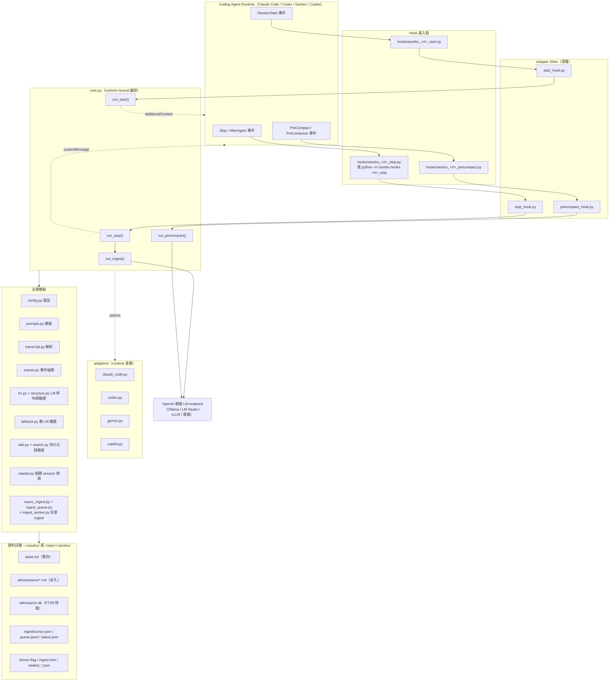

# Sesshu 架構

> 回到 [知識區入口](_index.md) ｜ 上一篇 [README.md](README.md) ｜ 下一篇 [installation-and-usage.md](installation-and-usage.md)

---

## 1. 全景圖



**來源**：`src/sesshu/core.py`、`src/sesshu/adapters/`、`src/sesshu/hooks/`、`hooks/`、
`AGENTS.md:120-153`（Architecture and Data Flow）

---

## 2. 三層責任切分

這是整個專案最重要的設計決定（**來源已確認**，`AGENTS.md:153`：
「Hook orchestration must stay runtime-neutral in `core.py`;
runtime-specific parsing and output details belong in `adapters/` or wrapper files.」）

```
┌─ 第 1 層：Wrapper ──────────────────────────────────────┐
│  hooks/sesshu_claude_stop.py（原始碼安裝）              │
│  python -m sesshu.hooks.claude_stop（pip 安裝）          │
│  → 只有 4 行：import main; raise SystemExit(main())     │
└──────────────────────────┬──────────────────────────────┘
                           ▼
┌─ 第 2 層：Shim ─────────────────────────────────────────┐
│  stop_hook.py / start_hook.py / precompact_hook.py      │
│  → 選定 Adapter，讀 stdin，呼叫 core，印出 stdout       │
│  → 每檔僅 16 行                                          │
└──────────────────────────┬──────────────────────────────┘
                           ▼
┌─ 第 3 層：Core（runtime-neutral）───────────────────────┐
│  core.py：run_ingest / run_stop / run_start /           │
│           run_precompact                                 │
│  → 所有商業邏輯都在這；完全不知道自己跑在哪個 runtime   │
│  → 靠 HookAdapter Protocol 抽象化 runtime 差異          │
└─────────────────────────────────────────────────────────┘
```

`HookAdapter` 是一個 `Protocol`（`src/sesshu/core.py:38-57`），只要求 7 個成員：

| 成員 | 作用 |
|---|---|
| `name` | runtime 名稱字串 |
| `record_stop_payload(payload)` | 記錄 stop payload（只有 Copilot 真的實作） |
| `parse_stop(payload) -> StopRequest` | 從 hook JSON 取出 `transcript_path` / `stop_hook_active` |
| `parse_precompact(payload) -> StopRequest` | 同上，用於 PreCompact |
| `parse_start(payload) -> StartRequest` | 取出 `source` |
| `build_stop_output(message) -> str` | 組出該 runtime 的 stop 輸出 JSON |
| `build_start_output(context, notify) -> str` | 組出該 runtime 的 start 輸出 JSON |

---

## 3. Adapter 比較表（**來源已確認**）

四個 adapter 都繼承 `ClaudeCodeAdapter`，只覆寫真正不同的部分。

| Runtime | 檔案 | Stop 事件名 | 設定檔 | Stop 輸出格式 | Start 輸出格式 |
|---|---|---|---|---|---|
| **Claude Code** | `adapters/claude_code.py` | `Stop` | `~/.claude/settings.json` | `{"systemMessage": ...}` | `{"hookSpecificOutput": {"hookEventName": "SessionStart", "additionalContext": ...}}` |
| **Codex** | `adapters/codex.py` | `Stop` | `~/.codex/hooks.json` | 同 Claude | 同 Claude |
| **Gemini CLI** | `adapters/gemini.py` | `AfterAgent` | `~/.gemini/settings.json` | 同 Claude | `{"hookSpecificOutput": {"additionalContext": ...}}`（無 `hookEventName`） |
| **Copilot CLI** | `adapters/copilot.py` | `Stop` | `~/.copilot/settings.json` | `{"decision": "block", "reason": ...}` 或 `{"decision": "allow"}` | `{"additionalContext": ...}` |

各 adapter 的專屬行為：

- **Codex**（`adapters/codex.py`）：只覆寫 `parse_stop()`，多讀一個 `last_assistant_message`
  欄位存進 `StopRequest`。⚠️ 該欄位在 `core.py:28-30` 被標為 *Reserved*，
  註解明說「Not yet consumed by `run_stop()`」——**目前是保留欄位，尚未使用**。
- **Gemini**（`adapters/gemini.py`）：只覆寫 `build_start_output()`，
  payload 不含 `hookEventName`。
- **Copilot**（`adapters/copilot.py`）：差異最大，有三處：
  1. **Pseudo-transcript**：Copilot CLI 不寫 `.jsonl` transcript 檔，而是把 stop 事件
     以 JSON 從 stdin 傳進來。`record_stop_payload()` 把 payload 追加寫成
     `<data_dir>/copilot_<sha256(session_id)>.jsonl` 的一行，
     讓既有的 `read_transcript()` 邏輯能直接沿用。（`adapters/copilot.py:27-31, 33-72`）
  2. **source 正規化**：Copilot 沒有 `/clear`。`_COPILOT_START_SOURCES = {"new", "startup", "resume"}`
     這三種 source 一律被映射成 `"clear"`，讓 `run_start()` 願意注入。（`adapters/copilot.py:12-14, 77-83`）
  3. **輸出用 `decision`**：而非 `systemMessage`。（`adapters/copilot.py:85-88`）

---

## 4. HITL mode 資料流（預設）

```
 每一輪 assistant 回覆結束
        │
        ▼
 ┌──────────────────────────────────────────────┐
 │ run_stop()   core.py:346                     │
 ├──────────────────────────────────────────────┤
 │ 1. load_config() + load_prompts()            │
 │ 2. mode != "hitl" ? → exit 0                 │
 │ 3. 讀並「立刻刪除」ingest/status.json（一次性）│
 │ 4. 讀並「立刻刪除」related_notice.json（一次性）│
 │ 5. stop_hook_active ? → exit 0（防迴圈）      │
 │ 6. prompts 空 ? → exit 0                     │
 │ 7. _prepare_ingest() ────────────┐           │
 │ 8. 讀 transcript 大小             │           │
 │ 9. < threshold ? → 只送待送通知    │           │
 │10. 無 seed ? → exit                │           │
 │11. shown.flag 存在 ? → exit（去重）│           │
 │12. 寫 shown.flag，送 systemMessage │           │
 └───────────────────────────────────┼───────────┘
                                     ▼
 ┌──────────────────────────────────────────────┐
 │ _prepare_ingest()   core.py:159              │
 ├──────────────────────────────────────────────┤
 │ ingest_mode == "background"?                 │
 │   YES → spawn_ingest_worker()（子行程，立刻回）│
 │   NO（預設 sync）→                            │
 │        adapter.record_stop_payload()          │
 │        run_ingest()（同步阻塞）               │
 └───────────────────┬──────────────────────────┘
                     ▼
 ┌──────────────────────────────────────────────┐
 │ run_ingest()   core.py:188                   │
 ├──────────────────────────────────────────────┤
 │ a. 讀 ingest/cursor.json                     │
 │    session_id 不符 → 重置 cursor              │
 │ b. 距上次 < INGEST_MIN_INTERVAL ? → skip     │
 │ c. diff = raw[chars_processed : +CHUNK_CHARS]│
 │    diff 為空 → skip                           │
 │ d. excerpt = diff[-MAX_INPUT:]               │
 │ e. extract_events(excerpt) → structured块     │
 │ f. seed 存在？→ stop.update；否則 stop.create │
 │ g. call_lm_with_retry()（最多 2 次，驗 12 段）│
 │ h. LM 失敗：                                  │
 │      無 seed → build_fallback_page() 並寫入   │
 │               （cursor 刻意不前進，下次重試） │
 │      有 seed → 回 "lm_error"，保留舊 seed     │
 │ i. extract_recent_turns(KEEP_TURNS)          │
 │ j. build_seed_content() → wiki 頁 + seed.md  │
 │ k. 寫 cursor.json = target_end               │
 │ l. SESSHU_RELATED=1 → _run_related_detection()│
 └──────────────────────────────────────────────┘
```

**來源**：`src/sesshu/core.py:159-186`（`_prepare_ingest`）、
`src/sesshu/core.py:188-334`（`run_ingest`）、`src/sesshu/core.py:346-475`（`run_stop`）

> ### ⚠️【文件不一致】ingest 預設是同步，不是背景
>
> 來源專案的 `CLAUDE.md`（「Data flow」段）與 `AGENTS.md` 描述
> Stop hook 一律呼叫 `async_ingest.spawn_ingest_worker()` 起背景 worker、hook 立刻回 0。
>
> 但實際程式碼 `src/sesshu/core.py:159-186` 的 `_prepare_ingest()` 是**分支的**：
> 只有 `config.ingest_mode == "background"` 才起背景 worker；
> 而 `SESSHU_INGEST_MODE` 的**預設值是 `"sync"`**（`src/sesshu/config.py:47`）。
>
> 也就是說**預設行為是同步 ingest**，Stop hook 會等 LM 回應。
> 要拿到「立刻返回」的行為，必須明確設定 `SESSHU_INGEST_MODE=background`。
> `README.md:394` 的設定表反而是正確的（`sync` 為預設）。
>
> **【推論】**：`CLAUDE.md` / `AGENTS.md` 應是在 `SESSHU_INGEST_MODE` 加入前寫的，未同步更新。

---

## 5. SessionStart 資料流

```
/clear（或 runtime 的等價事件）
        │
        ▼
 ┌──────────────────────────────────────────────┐
 │ run_start()   core.py:598                    │
 ├──────────────────────────────────────────────┤
 │ 1. accepted source 判定：                     │
 │      hitl → {"clear"}                        │
 │      auto → {"compact", "clear"}             │
 │    不符 → exit 0                              │
 │ 2. ingest.lock 存在？                         │
 │      is_lock_stale() → 刪掉搶回                │
 │      否則輪詢最多 INGEST_WAIT_SECONDS 秒      │
 │      逾時仍在 → 用最後一份完整 seed 繼續      │
 │      （write_private_text 原子發佈，          │
 │        不會讀到寫到一半的檔）                 │
 │ 3. 刪除 related_state.json / related_notice   │
 │ 4. 無 prompts / 無 seed → exit 0             │
 │ 5. select_wiki_pages(wiki_dir, summary)      │
 │      → sync_missing_pages() 同步 FTS 索引     │
 │      → extract_keywords() 取關鍵字            │
 │      → search_wiki() FTS5，失敗退回 grep      │
 │      → 沒結果就取最近 5 頁                    │
 │ 6. context = seed + build_wiki_hint(pages)   │
 │ 7. SESSHU_VERBOSE=1 → 附 restore 通知         │
 │ 8. adapter.build_start_output()              │
 │ 9. 刪除 seed.md / shown.flag /               │
 │    ingest/cursor.json / status.json /        │
 │    queue.jsonl                                │
 └──────────────────────────────────────────────┘
```

**來源**：`src/sesshu/core.py:598-683`、`src/sesshu/wiki.py:64-84`（`select_wiki_pages`）

---

## 6. Auto mode 資料流

`SESSHU_MODE=auto` 時：

- `run_stop()` 在 `core.py:356-359` 直接短路 exit 0 → **Stop hook 變 no-op**
- `run_ingest()` 在 `core.py:198-201` 同樣短路
- 所有壓縮改走 `run_precompact()`（`core.py:478-582`）
- `run_start()` 接受的 source 從 `{"clear"}` 擴大為 `{"compact", "clear"}`（`core.py:609`）

`run_precompact()` 與 `run_ingest()` 的**關鍵差異**（**來源已確認**）：

| | `run_ingest()`（HITL） | `run_precompact()`（auto） |
|---|---|---|
| 輸入切片 | `raw[cursor : cursor+CHUNK]` 的**增量 diff** | `raw[-MAX_INPUT:]` 的**尾端切片** |
| cursor | 讀寫 `ingest/cursor.json` | **完全不碰 cursor** |
| 最小間隔 gate | 有（`INGEST_MIN_INTERVAL`） | **無** |
| 使用者可見輸出 | 有（`systemMessage`） | **無，靜默返回** |
| related 偵測 | 有（若 `SESSHU_RELATED=1`） | **無** |

**來源**：`src/sesshu/core.py:518`（precompact 用尾端切片）vs `core.py:249-256`（ingest 用 cursor diff）

事件名對照（`README.md:101`、`src/sesshu/cli.py:208, 228, 249, 265`）：

| Runtime | 預壓縮事件 |
|---|---|
| Claude Code | `PreCompact` |
| Codex | `PreCompact` |
| Copilot CLI | `PreCompact` |
| Gemini CLI | **`PreCompress`** |

---

## 7. 三個安全閘門

**【來源已確認】**

### 7.1 exit-0 保證

每一個 hook 出口都回 `0`。`lm.py:52-71` 攔了 `HTTPError` / `URLError` / `MemoryError` /
`JSONDecodeError` / `TimeoutError` / `socket.timeout` / `HTTPException` / `OSError`，
最後還有一個 `except Exception` 全攔的 catch-all（`lm.py:69-71`），註解寫
「catch-all to ensure hooks never raise」。`_run_related_detection()` 整個包在
`try/except Exception: pass`（`core.py:140-141`）。

### 7.2 迴圈防護

- `stop_hook_active` 為真 → 立刻 exit（`core.py:396-399`、`core.py:205-208`）
- `shown.flag` 存在 → 不重複送提示（`core.py:447-455`）
- `systemMessage` 文字必須是「事實陳述 + 簡短建議」，**不得含 next-steps 或
  任務指令語氣**——來源明列此為已知的無限迴圈觸發因子
  （`CLAUDE.md`「Coding Constraints」、`AGENTS.md:163`）

### 7.3 transcript 唯讀

hook 不得寫入、截斷或刪除 transcript `.jsonl`（`AGENTS.md:163`）。
`transcript.py` 只有 `read_text()` 與唯讀 `open()`，無任何寫入路徑。

---

## 8. 設定與資料目錄的雙軌設計

這是安全性上最巧妙的一段（**來源已確認**，`src/sesshu/config.py:161-181`）：

```
                 SESSHU_DATA_DIR 有設嗎？
                        │
        ┌───── YES ─────┴───── NO ──────┐
        ▼                                ▼
  config_dir = $SESSHU_DATA_DIR    config_dir = ~/.sesshu   ← 永遠不看專案目錄
  data_dir   = $SESSHU_DATA_DIR    data_dir   = ./.sesshu 若存在
                                              否則 ~/.sesshu
```

- `config_dir` 決定 **`.env` 和 `prompts.json` 從哪讀**（`_config_dir()`，`config.py:161-170`）
- `data_dir` 決定 **seed / wiki / flag / debug 寫哪裡**（`_default_data_dir()`，`config.py:173-180`）
- 未設 `SESSHU_DATA_DIR` 時，**config 只從 home 讀，data 才允許用專案目錄**

理由（`README.md:487`、`config.py:162-166` docstring）：
防止一個 repo 光靠放 `.sesshu/.env` 或 `.sesshu/prompts.json` 就劫持 LM endpoint 或注入 prompt。

⚠️ **重要限制**：`SESSHU_DATA_DIR` **只從 process environment 讀，不從 `.env` 讀**
（它必須先知道要讀哪個 `.env`）。它也不在 `DOTENV_KEYS` 白名單裡（`config.py:54-73`）。
所以**把 `SESSHU_DATA_DIR` 寫進 `.sesshu/.env` 是無效的**。

設定優先序（`README.md:364-369`、`config.py:145-158` 的 `_first()`）：

```
1. process env 的 SESSHU_*        ← 最高
2. config_dir/.env 的 SESSHU_*
3. process env 的 legacy CC_*      ← 注意：legacy 不吃 .env
4. 內建預設值
```

---

## 9. Wiki 持久化與檢索

```
.sesshu/wiki/
├── sessions/
│   ├── 2026-08-06-142530-session.md      ← 每次 ingest 寫一頁
│   └── 2026-08-06-151204-session.md
├── index.md                               ← 附加式索引（- 時間: 路徑）
├── log.md                                 ← 附加式 log，1 MB 輪替成 log.1.md
└── search.db                              ← SQLite FTS5 索引（衍生快取）
```

- **寫入時**：`write_wiki_page()`（`wiki.py:34-62`）產生
  `YYYY-MM-DD-HHMMSS-session.md`，撞名就加 `-2`、`-3`…，
  然後呼叫 `update_search_index()` upsert 進 FTS。
- **讀取時**：`select_wiki_pages()`（`wiki.py:64-84`）先 `sync_missing_pages()`
  對帳（新增、mtime 改變、已刪除三種都處理），再 `extract_keywords()` → `search_wiki()`。
- **檢索降級鏈**（`search.py:136-163`）：
  `search.db` 存在 → FTS5 `MATCH` 查詢 → 有結果就用
  → 任何例外或 0 結果 → `_grep_search()`（正則計數排序）
  → 仍無 → 最近 5 頁（`wiki.py:81-82`）
- `search.db` 是**衍生快取，刪掉安全**（`AGENTS.md:155`、`README.md:485`）。

**FTS5 injection 防護**：關鍵字被逐個加雙引號後才組成 `MATCH` 查詢
（`search.py:148`，註解明寫 "Quote each keyword to prevent FTS5 operator injection"）。

**關鍵字抽取**（`search.py:21-52`）：只從
`## Goal` / `## Current state` / `## Tasks` / `## Blockers` 四個段落取文字
（找不到就退回全文），tokenize 成長度 ≥3 且至少含一個字母的 alphanumeric，
濾掉 stopword，依頻率取前 20 個。

---

## 10. LM-free 備援路徑

當 LM 掛掉且**還沒有 seed** 時，Sesshu 不會什麼都不做：

```
extract_events(excerpt)            events.py:86-102
   ├─ tool_use / name ∈ {Write, Edit, NotebookEdit} → file_edits（去重）
   ├─ tool_use / name == "Bash"
   │     命令含 "git " → git_ops（去重，截 80 字元）
   │     否則           → bash_commands（去重，上限 20 筆）
   └─ tool_result / is_error 為真   → errors（截 120 字元）
          ↓
build_fallback_page(events)        fallback.py:9-24
   → 產生 12 段皆齊全、結構合法的 wiki 頁
   → Code changes / Git operations / Errors & resolutions 填實際內容
   → Current state 固定寫 "Fallback snapshot (LM unavailable). Re-ingest pending."
   → 其餘段落填 *(none)*
```

**關鍵細節**（`core.py:295-297` 註解）：寫 fallback 之後**刻意不推進 cursor**，
因為 LM 還沒真的處理過這段內容——下一輪 ingest 會用完整 diff 重試，
並用正式的 LM 摘要取代這份 fallback 快照。

`format_structured_events()`（`events.py:104-121`）把同一份 snapshot 序列化成文字塊，
透過 `prompts.json` 裡的 `{structured_events}` 佔位符注入 LM prompt——
所以事件抽取是**雙用**的：既是備援，也是提升 LM prompt 品質的訊號。

---

## 11. 背景 ingest 機制（opt-in）

只有 `SESSHU_INGEST_MODE=background` 時啟用。

```
spawn_ingest_worker()   async_ingest.py:162
  1. _record_stop_payload()（Copilot 用）
  2. _enqueue_transcript_range() → ingest/queue.jsonl
  3. SESSHU_INGEST_SYNC=1 ? → _run_inline() 直接跑完返回
  4. 間隔 gate：距上次 ingest < MIN_INTERVAL → 不 spawn
  5. 原子建鎖：os.open(O_CREAT|O_EXCL|O_WRONLY, 0o600)
     鎖內容 {session_id, pid, token, state, ts}
     FileExistsError → 已有 worker 在跑
     其他 OSError → 重試 3 次（0.05s / 0.10s backoff，Windows 檔案系統友善）
  6. spawn ingest_worker.py 子行程

ingest_worker.py main()  ingest_worker.py:89
  → _queue_payloads() 從 queue 取自己 runtime 的記錄
  → _run_ingest_returning_status() → True / False / None
  → _update_queue()
        True  → 從 queue 刪除該筆
        False → attempts+1；達 INGEST_MAX_RETRIES 就刪除，否則留著
        None  → 不動
  → True  → 刪除 status.json
    False → 寫 status.json {"status":"error", ...} 供下次 run_stop() 一次性讀取
  → finally: _release_lock()（比對 token 才刪，避免刪到別人的鎖）
```

**鎖過期判定** `is_lock_stale()`（`async_ingest.py:94-128`）視為 stale 的四種情況：
讀不到 / JSON 壞掉 / pid 為 0 或缺失（舊格式）/ pid 對應的行程已死 /
鎖的年齡 > LM `timeout`。

**Windows 專屬修正**（`async_ingest.py:130-160`）：
`os.kill(pid, 0)` 在 Windows 上會走到 `TerminateProcess` 分支——
**會排程終止目標行程**，若 pid 是自己就是致命 bug。
所以 Windows 改用 `OpenProcess(PROCESS_QUERY_LIMITED_INFORMATION)`，不送任何 signal。

---

## 12. 原子寫入

所有 Sesshu 產生的檔案都走 `write_private_text()`（`io.py:128-163`）：

```
1. ensure_private_dir(parent)                    → mode 0o700
2. os.open(tmp, O_WRONLY|O_CREAT|O_EXCL, 0o600)  → 唯一暫存檔名含 pid + uuid4
3. write → flush → os.fsync(fd)
4. tmp.chmod(0o600)
5. os.replace(tmp, path)                          ← 原子換名
6. path.chmod(0o600)
7. os.fsync(父目錄 fd)
finally: 換名沒成功就刪掉 tmp
```

這就是為什麼 `run_start()` 即使在 background worker 還持有鎖時去讀 `seed.md`
也安全——原始碼註解明說「`write_private_text()` publishes seed updates atomically,
so this never reads a half-written file」（`core.py:633-635`）。

---

## 13. Command 層

`commands/sesshu-config.md` 是一個 **slash command 的 prompt 檔**，不是可執行程式。
它安裝成 `/sesshu-config`，內容是給 agent 讀的指示：讀 `.env`、列出設定、
驗證 `KEY=VALUE` 並寫回。

安裝時 `__SESSHU_ENV_PATH__` 佔位符會被替換成實際的 `.env` 路徑
（`src/sesshu/cli.py:152-157`、`install.ps1` 的 `InstallCommandFile`），
所以用 `SESSHU_DATA_DIR=/path` 安裝的話，指令會去編輯 `/path/.env`。

支援的 runtime：**Claude Code、Codex、Gemini CLI**。
**Copilot CLI 沒有相容的 command 目錄，不安裝此指令**
（`cli.py:288`、`README.md:445`）。

---

**下一步** → [installation-and-usage.md](installation-and-usage.md)
